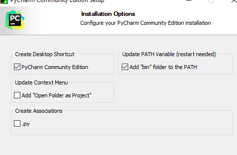

**Ticket 157** 

**PyCharm editions:**

**PyCharm Community Edition**:Free to use.Offers essential features for Python development, including code editing, debugging, and version control.Supports popular frameworks like **Flask** and **Django**.**Limited** support for web development, database tools, and scientific tools.Suitable for individual developers and **small projects.**

**PyCharm Professional Edition:**Paid version with a license fee.Includes all features of the Community Edition.Offers advanced tools and integrations for web development, database development, scientific development, and more.Provides enhanced support for frameworks like Django, Flask, and FastAPI.Includes additional tools like the HTTP client, Docker integration, and remote development capabilities.Suitable for professional developers and teams working on complex projects.

**In summary,** the Community Edition provides the basic features needed for Python development, while the Professional Edition offers more advanced features and tools to enhance productivity and support a wider range of frameworks and development scenarios. 

**We can install pycharm from:**

<https://www.jetbrains.com/fr-fr/pycharm/download/#section=windows>

**This is a basic installation video:**

<https://www.youtube.com/watch?v=XsL8JDkH-ec>

Np: You can check your email for jetbrains student packs to use the pro edition!

**Create fastApi project**

**The recommended tools, extensions, and configurations for FastAPI development in PyCharm**

**Python interpreter:** Ensure we have a compatible Python interpreter set up in PyCharm. FastAPI supports Python 3.7 and above, so make sure we have a corresponding interpreter configured.

**Code autocompletion:** Press Ctrl+Space or choose Code | Code Completion | Basic from the main menu. If necessary, press Ctrl+Space for the second time (or press Ctrl+Alt+Space ). This shows the names of classes, functions, modules, and variables

**Pydantic plugin:** FastAPI heavily relies on Pydantic for data validation and serialization. Install the "Pydantic" plugin in PyCharm to get better support for Pydantic models, automatic type inference, and validation.

**HTTP client:** FastAPI provides built-in support for generating API documentation and testing the endpoints. However, we can further improve the development experience by using the "HTTP Client" tool in PyCharm to send HTTP requests directly from our IDE. This can be useful for testing our API endpoints during development.

**Click Tools | HTTP Client | Create Request in HTTP Client. If a request file is opened in the editor, this will add a request template to the opened file. Otherwise, this will create a new . http scratch file.**

	****

**Formatter and Linter:** Configure code formatting and linting tools like "**Black**" and "**Flake8**" in PyCharm to ensure consistent code style and catch potential errors. We can configure these tools under "Editor" -> "Inspections" and "Editor" -> "Code Style" settings.

**Debugger:** PyCharm's debugger is a powerful tool for identifying and fixing issues in FastAPI applications. Set breakpoints in the code to analyze variables, step through the code execution, and debug any problems that may arise.

Select **breakpoints**: cntrl + shift + f8

**Git integration:** FastAPI projects can benefit from version control using Git. Enable Git integration in PyCharm to manage the project's source code, track changes, and collaborate with teammates effectively.

**Docker support:** If we are using Docker for containerization, PyCharm provides excellent support for Docker integration. We can configure and manage our Docker containers within the IDE, making it easier to develop and deploy FastAPI applications.

**setting up PyCharm for FastAPI development**

**install FastAPI and Uvicorn (a high-performance ASGI server)**

When developing with FastAPI and Uvicorn, FastAPI handles the routing, request validation, response serialization, and API documentation generation, while Uvicorn takes care of serving the FastAPI application and handling the HTTP protocol.This combination provides a robust and efficient framework for building high-performance web APIs in Python.

**Configure PyCharm settings**

Open the "**Settings**" or "**Preferences**" dialog in PyCharm. We can access it through the "File" menu on Windows/Linux or the "PyCharm" menu on macOS.In the settings window, navigate to "**Editor**" -> "**Code Style**" and configure the code style according to the preferred preferences. It's recommended to follow the PEP 8 style guide.Next, go to "**Editor**" -> "**Inspections**" and enable the desired inspections for code analysis and error checking. It's recommended to enable "PEP8 coding style 

violation" and "Python type hints" inspections.Save the settings.

**Configure the Python interpreter**

Open the "**Settings**" or "Preferences" dialog in PyCharm.Navigate to "**Project**" -> "**Python Interpreter**".Click on the gear icon and select "**Add**" to add a new interpreter.Choose the Python interpreter we installed and click "OK".PyCharm will configure the interpreter for the project.

**Configure the Run Configuration**

In the PyCharm toolbar, click on the "**Edit Configurations**" button (or go to "**Run**" -> "**Edit Configurations**").Click the "**+**" button and select "**Python**".In the "**Script Path**" field, enter the path to the FastAPI application's main file.In the "**Parameters**" field, enter the following

uvicorn main:app --reload

Replace main with the name of the FastAPI application's main file.

**And finally we can run the project via that port**

**We can use /docs for swagger api**

